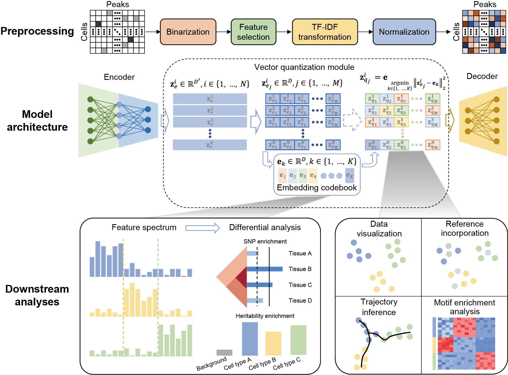

# single-cell Chromatin Accessibility Sequencing data analysis via discreTe Latent Embedding



## Installation  

CASTLE neural network is implemented in [Pytorch](https://pytorch.org/) framework.  
Running CASTLE on CUDA is recommended if available.   

    pip install castle

## Tutorial
We provide a [quick-start notebook](https://github.com/cuixj19/CASTLE/blob/main/demo.ipynb) for the training, evaluation, visualization and feature spectrum of CASTLE, and a [quick-start notebook](https://github.com/cuixj19/CASTLE/blob/main/prepare_data.ipynb) for the preparation of h5ad-formatted file.

### Input   
* h5ad file
* **count matrix file**:  
	* row is peak and column is barcode, in **txt** / **tsv** (sep=**"\t"**) or **csv** (sep=**","**) format

### Run and reproduce   
**Use 'CASTLE.py' to reproduce the results of CASTLE and apply CASTLE to users' own dataset.**  
```  
$ python CASTLE.py -d input_file -o output_dir
```

Use '--batch_name', '--batch_loss_weight' and '--batch_loss_ratio' for dataset with multiple batches.
```  
$ python CASTLE.py -d input_file -o output_dir --batch_name batch --batch_loss_weight 0.001 --batch_loss_ratio 0.1
```

Use '--reference' and '--target_name' for dataset with unlabeled reference dataset, assuming 'batch1' is the target data.
```  
$ python CASTLE.py -d input_file -o output_dir --reference 1 --target_name batch1
```

Use '--cell_loss_weight', '--cell_loss_ratio' and '--clf_loss_weight' for dataset with labeled reference dataset.
```  
$ python CASTLE.py -d input_file -o output_dir --reference 2 --target_name batch1 --cell_loss_weight 0.001 --cell_loss_ratio 0.1 --clf_loss_weight 1.0
```

**Optional arguments:**
```  
	--data_list, -d
		A path list of AnnData matrices to concatenate with.
	--join
		Use intersection ('inner') or union ('outer') of variables of different batches. Default: 'inner'.
	--batch_name
		Use this annotation in obs as batches for training model. Default: 'batch'.
	--cell_type_name
		Use this annotation in obs as cell types for training model. Default: 'cell_type'.
	--reference, -r
		If equal to 0, do not incorporate the reference dataset. If equal to 1, incorporate unlabeled reference dataset. If equal to 2, incorporate labeled reference dataset. Default: 0.
	--target_name
		If and only if reference is not 0, this annotation is valid and indicates the batch as the target. Default: 'batch'.
	--min_features
		Minimum number (integer) or ratio (float) of features required for a cell to pass filtering. Default: 0.
	--min_cells
		Minimum number (integer) or ratio (float) of cells required for a feature to pass filtering. Default: 0.01.
	--enc_dims
		The number of nodes in the linear layers of encoder. Default: [1024, 256].
	--latent_dim, -l
		The dimension of latent embeddings. Default: 50.
	--n_embed
		The size of codebook. Default: 400.
	--split
		The number of split quantizations. Default: 10.
	--ema
		If True, adopt the exponential moving average (EMA) to update the codebook instead of the codebook loss. Default: True.
	--commitment_cost
		The weight of commitment loss designed for encoder. Default: 0.25.
	--decay
		The decay ratio when ema is True. Default: 0.99.
	--batch_loss_weight
		The weight of batch loss. Default: 0.001.
	--batch_loss_ratio
		The proportion of pairs of quantized features when compute the batch loss. Default: 0.1.
	--celltype_loss_weight
		The weight of celltype loss. Default: 0.001.
	--celltype_loss_ratio
		The proportion of pairs of quantized features when compute the celltype loss. Default: 0.1.
	--clf_loss_weight
		The weight of clf loss. Default: 1.0.
	--batch_size
		Number of samples per batch to load. Default: None.
	--lr
		Learning rate. Default: 1e-4.
	--max_iteration
		Max iterations for training. Training one batch_size samples is one iteration. Default: 100000.
	--seed
		Random seed for torch and numpy. Default: 124.
	--gpu
		Index of GPU to use if GPU is available. Default: 0.
	--outdir, -o
		Output directory. Default: 'output/'.
	--ignore_umap
		If True, do not perform UMAP for visualization, louvain for clustering and clustering evaluation. Default: False.
	--verbose
		Verbosity, True or False. Default: False.
```

### Output   
Output will be saved in the output folder including:
* **checkpoint/config.pt** and **checkpoint/model.pt**:  saved model to reproduce results.
* **adata.h5ad**:  saved data including latent embeddings, clustering assignments and UMAP results.
* **results.csv**:  saved performance evaluation of clustering assignments and ground-truth cell type labels.

## Contact 
If you have any questions, you can contact me from the email: <cuixj19@mails.tsinghua.edu.cn>
